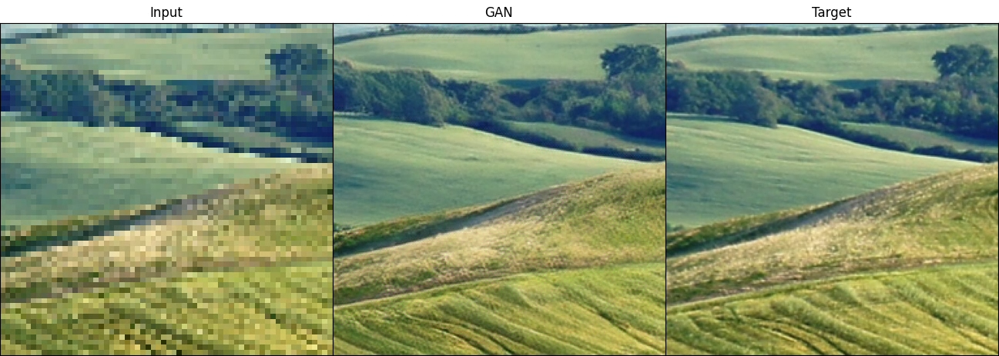
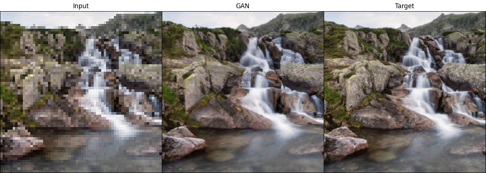

# Image Upscaler
The goal of this project was to design a model to upscale images by 4x and 16x their original resolution. The models featured in this repository are based off the [SRGAN](https://arxiv.org/abs/1609.04802), [ESRGAN](https://arxiv.org/abs/1809.00219), and [ESRGAN+](https://arxiv.org/abs/2001.08073) research papers. In the image below, input is the low resolution image to upscale, target is the original high resolution image, and GAN is the upscaled image using the fully trained model.




## Data.py
https://www.kaggle.com/datasets/evgeniumakov/images4k

The Dataset provided above is the Images4k dataset, it contains ~2000 images of resolution ~(3840 x 2160). These images are loaded using OpenCV in RGB before a number of actions are performed to prep the data. First a blur is applied to 20% of all images, then images are randomly resized to a smaller image. Next, gaussian noise is applied to 20% of images. Lastly 50% of images are compressed using the JPEG Compression Algorithm. The output is normalized between 0 - 1 and then fed into the model. Getting the target image is similar, however the image is not altered outside of being resized. The alterations are done in order to manage a robust variety of artifacts and alterations that might occur in an image.

## Pre-trained models
Here is the [link](https://drive.google.com/drive/folders/1sFOUnEaiIQW57rGBu1H1bmxdiMhklQHh?usp=sharing) to our pre-trained models on the Images 4k dataset.

## Files & Usage
- config.ini
  - Specify model and datset paths to use
- data.py
  - Loading images
  - Processing images
- esrgan.py
  - Generator class
  - Discriminator class
  - GAN train loop
  - Add `--test` flag for testing (default: training)
- rrdbnet_4x.py
  - Base 4x upscale model
  - Train loop
  - Add `--test` flag for testing (default: training)
- rrdbnet_16x.py
  - Base 16x upscale model
  - Train loop
  - Testing
  - Add `--test` flag for testing (default: training)
- test_model.py
  - Testing models
  - Comparing models
- upscale.py
  - Testing models on specific images

## Example Usage
1. Download `sr_gen_final.pt`.
2. Change `generator` in `config.ini` to the location of the downloaded model.
3. Download the dataset provided or use your own.
4. Change `test_data` in `config.ini` to the location of your test images.
5. Run the following command in your terminal:

```shell
python esrgan.py --test
```

## Training Process
### Base 4x Upscaling `rrdbnet_4x.py`
The first step to making the image upscaler is to train the base 4x upscaling model. Here, we load the latest model checkpoint if it exists, otherwise we make a new one. Then, we load the dataset and initialize the dataloader with a batch size of 16 and shuffling enabled. The loss we use to train this model is L1 loss. This is generally more stable than L2 loss. We use Adam optimizer with a learning rate of 0.0002.
### Base 16x Upscaling `rrdbnet_16x.py`
The second step starts with initializing the 16x model with the previous 4x model. This way, we just need to train the last few layers to upscale to 16x resolution. The training parameters are the same as the base 4x upscaling model.
### GAN `esrgan.py`
Once the 16x model is fully trained, we use it to initialize the generator for the final model. The discriminator learns from scratch. When training the GAN we needed to reduce the batch size to 10 because of limited video memory. It is recommended to train this with a much higher batch size (original paper is 48). For the optimizer, we are also using Adam, but the learning rate decreases over time. It starts at 0.0001 and decreases by half every 50k, 100k, 200k, and 300k batches. For the discriminator loss, we are using relativistic hinge loss. For the generator loss, we are using perceptual loss, l1 loss (scaled by 0.005), and relativistic hinge loss (scaled by 0.001).
### Final Notes
This model was trained using an RTX 4080 GPU. The entire training process takes about 1.5 days to complete.